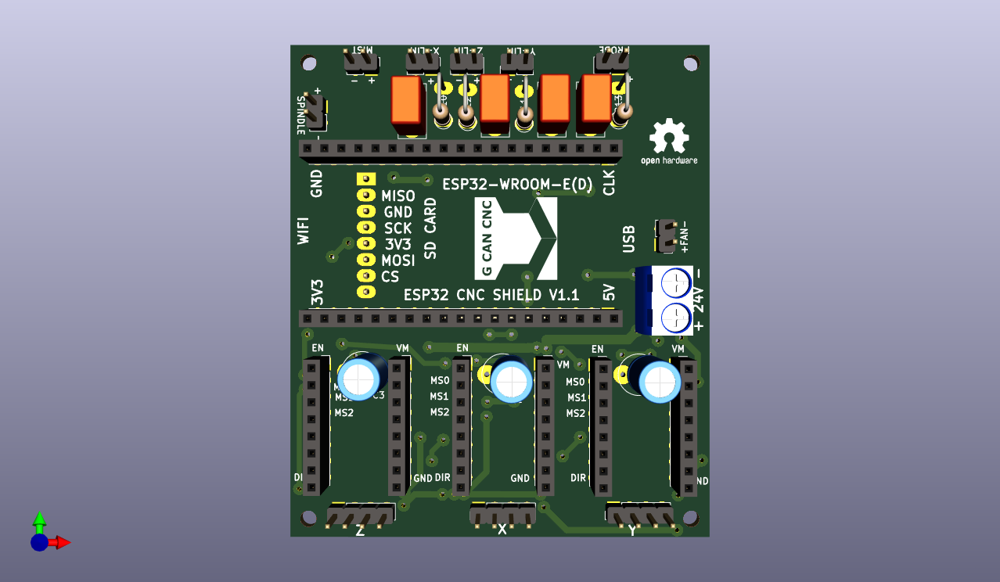

# ESP32-CNC-SHIELD

I started this proyect to use the ESP32 module devkit with GRBL for my actual CNC machines, to substitute the actual Arduino Uno with Protoneers CNC SHIELD(both originals) and GRBL V1.1. 
Be able to run g-code from sd-card and web interface without any computer directly connected.
On my big machine(385x325x95) i have endstops(X, Y, Z), probe, mist and a reley for the router. 
It uses 24V and 2,8A for the Nema23 motors and DRV8825 drivers with half micro step for all axis, to run them at max force, as i cut  a lot of aluminum: wood, plastics and pcb:s. I don't need more features.
Bart Dring has done a good job with the "port" and modifications and new funtions.
I also preconfigured the micro steps on the board, but it can easely changed for more micro steps, shorting the(MS0,MS1 y MS2) to obtain up to 256 microsteps.

The version V1.0 was pretty instructiv, but i did the traces to small 0,5mm. It was not enough, the drillbit cut them in various places. 
So i decided to make a new version, also the size was not optimized to cut two on the same pcb board(150x100).

Versión V1.1 have some changes in size and components placement to be able to cut 2 units on the same pcb board 150x100mm.
Now the size is 66x72. I made it so big as the traces are only on one side.
If it works as intended i surely will make a SMD version, with JST connectors to avoid loose cables.
